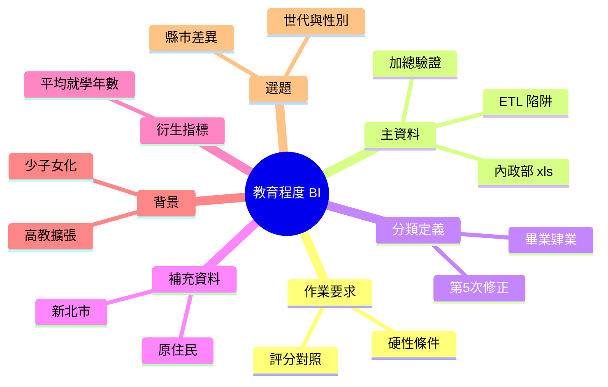

# 歷年各年齡層教育程度 BI 作業研究

支援「**用公開統計資料做 ETL、互動 BI 網頁,再用 GitHub Pages 發佈**」這份作業的研究筆記。資料截至 **2026-10-07**,來源限定老師列的網站。

> **這個知識庫不是作業成品,也不會被評分。** 它只做研究與選題,BI 網頁與 ETL 之後要在**另一個新的 public repo** 做。

## 先看這五點

1. **你的內政部檔案很適合**:38 張表、民國 96–114 年,每年有「年齡 × 性別 × 教育程度」和「縣市」兩張。**我逐年驗證過,加總全部通過**,而且用它算的大專以上比率和戶政司報告**完全一致**(97 年 34.91%、103 年 41.75%、107 年 45.52%)。([檔案結構與 ETL 重點](內政部檔案結構與ETL重點.md))
2. **有幾個髒資料陷阱**:年齡標籤藏在合併儲存格、96–97 年研究所沒分博碩、105 年起表頭改名、縣市表含小計列。這些就是 ETL 高分的素材。
3. **建議主題**:各年齡層大專以上比率的世代差異與**性別翻轉**(年輕女性高於男性,高齡相反),這個預覽我已經用你的檔案算過。([選題建議](選題建議.md))
4. **要小心撞題**:這是很顯眼的資料,主題要有辨識度。我查不到別人已用的主題。
5. **評分提醒**:AI 每個檔案只讀前 200 KB、Excel 只看前 200 列。你的 `.xls` 有 775 KB,驗證結果要放在讀得到的地方。([作業需求與評分對照](作業需求與評分對照.md))

## 知識樹

## 筆記清單

| 筆記 | 內容 |
|---|---|
| [作業需求與評分對照](作業需求與評分對照.md) | 硬性條件、評分項目、AI 怎麼看你的作業 |
| [內政部檔案結構與 ETL 重點](內政部檔案結構與ETL重點.md) | 你下載檔案的結構、髒資料、驗證結果、性別預覽 |
| [教育程度分類與定義](教育程度分類與定義.md) | 官方分類沿革、第 5 次修正、對你資料的影響 |
| [補充資料來源](補充資料來源.md) | 新北市資料集、內政部其他表、沒找到的 |
| [平均就學年數與衍生指標](平均就學年數與衍生指標.md) | 官方算法、怎麼用你的檔案算 |
| [背景與趨勢](背景與趨勢.md) | 高教擴張、少子女化、人才供給 |
| [選題建議](選題建議.md) | 五個候選主題、建議、網頁上要寫的限制 |
| [參考資料](參考資料.md) | 來源清單、已排除的來源 |

## 後續步驟(不在這個知識庫內)

1. 到 Discord 看有沒有人已用同樣的「資料來源 + 主題」,**盡早決定**
2. 另開新的 public repo(不要用課堂 repo)
3. 寫 ETL,輸出整理後的資料與驗證結果
4. 做互動網頁(篩選、連動、手機版)
5. 開啟 GitHub Pages,把 `https://<帳號>.github.io/...` 貼到 `#ndhu-ba-2026`
6. 確認 Discord 已允許伺服器成員私訊

**我可以幫你**寫 ETL 與網頁的程式,但你的環境目前沒有 `pandas`、`xlrd`、`openpyxl`,發佈與繳交需要用你自己的帳號。要不要接著做,告訴我。

## 如何繼續追問

回到 NotebookLM notebook `7617d437-0df4-40ad-9d2d-a9d13d576137` 可以追加來源或追問。
